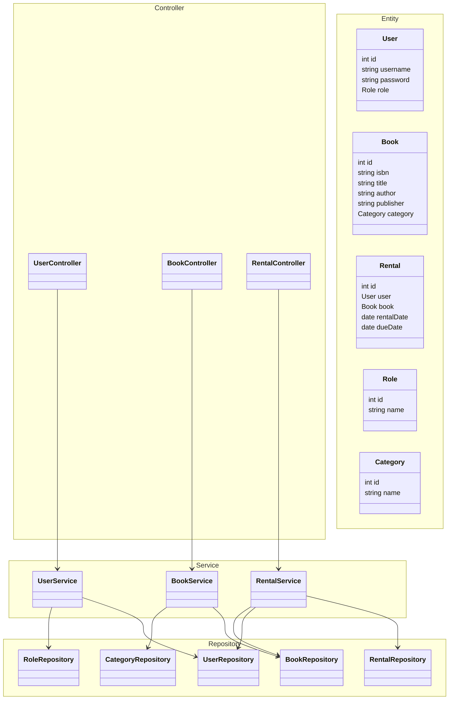

```mermaid
    classDiagram
        namespace Controller {
            class UserController {
            }

            class BookController {
            }

            class RentalController{
            }
        }

        namespace Service {
            class UserService {
            }

            class BookService {
            }

            class RentalService {
            }
        }

        namespace Repository {
            class UserRepository {
            }

            class BookRepository {
            }

            class RentalRepository {
            }

            class RoleRepository {
            }

            class CategoryRepository {
            }
        }

        namespace Entity {
            class User {
                int id
                string username
                string password
                Role role
            }

            class Book {
                int id
                string isbn
                string title
                string author
                string publisher
                Category category
            }

            class Rental {
                int id 
                User user
                Book book
                date rentalDate
                date dueDate
            }

            class Role {
                int id
                string name
            }

            class Category {
                int id
                string name
            }
        }

        UserController --> UserService
        BookController --> BookService
        RentalController --> RentalService

        UserService --> UserRepository
        UserService --> RoleRepository

        BookService --> BookRepository
        BookService --> CategoryRepository

        RentalService --> RentalRepository
        RentalService --> UserRepository
        RentalService --> BookRepository
```