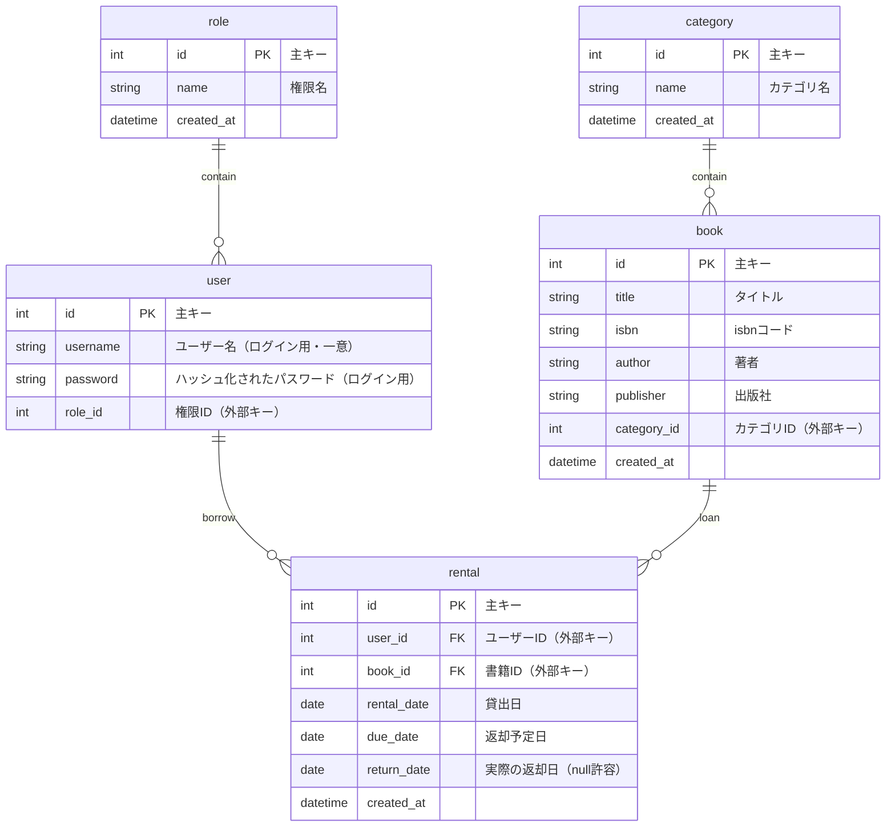

```mermaid
    erDiagram
        user {
            int id PK "主キー"
            string username "ユーザー名（ログイン用・一意）"
            string password "ハッシュ化されたパスワード（ログイン用）"
            int role_id "権限ID（外部キー）"
        }

        book {
            int id PK "主キー"
            string title "タイトル"
            string isbn "isbnコード"
            string author "著者"
            string publisher "出版社"
            int category_id "カテゴリID（外部キー）"
            datetime created_at
        }

        rental {
            int id PK "主キー"
            int user_id FK "ユーザーID（外部キー）"
            int book_id FK "書籍ID（外部キー）"
            date rental_date "貸出日"
            date due_date "返却予定日"
            date return_date "実際の返却日（null許容）"
            datetime created_at
        }

        category {
            int id PK "主キー"
            string name "カテゴリ名"
            datetime created_at
        }

        role {
            int id PK "主キー"
            string name "権限名"
            datetime created_at
        }

        user ||--o{ rental : "borrow"
        book ||--o{ rental : "loan"
        category ||--o{ book : "contain"
        role ||--o{ user : "contain"
```
