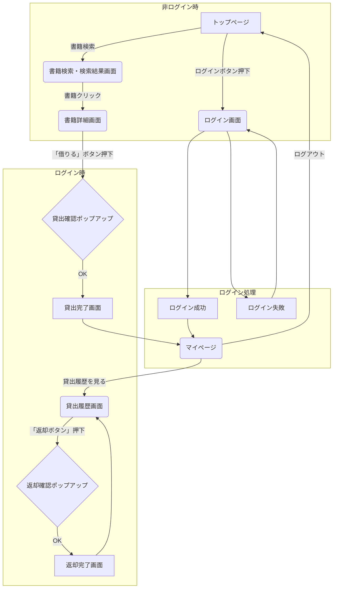

```mermaid
    graph TD
        A[トップページ]
        B(ログイン画面)
        C(マイページ)
        D(書籍検索・検索結果画面)
        E(書籍詳細画面)
        F{貸出確認ポップアップ}
        G[貸出完了画面]
        H(貸出履歴画面)
        I{返却確認ポップアップ}
        J[返却完了画面]

        subgraph "非ログイン時"
            A -->|書籍検索| D
            D -->|書籍クリック| E
            A -->|ログインボタン押下| B
        end

        subgraph "ログイン処理"
            B --> ログイン成功 --> C
            B --> ログイン失敗 --> B
        end

        subgraph "ログイン時"
            E -->|「借りる」ボタン押下| F
            F -->|OK| G
            G --> C

            C -->|貸出履歴を見る| H
            H -->|「返却ボタン」押下| I
            I -->|OK| J
            J --> H

            C -->|ログアウト| A
        end
```